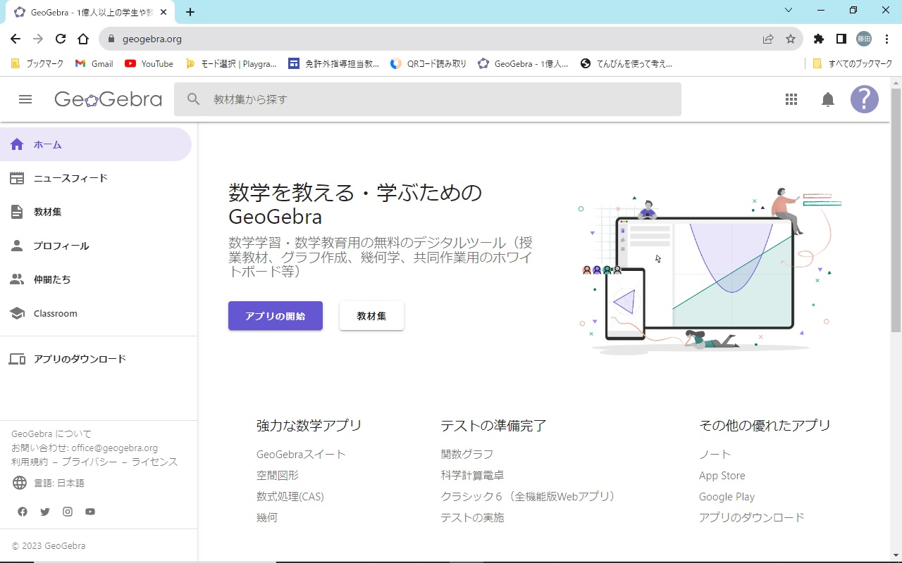
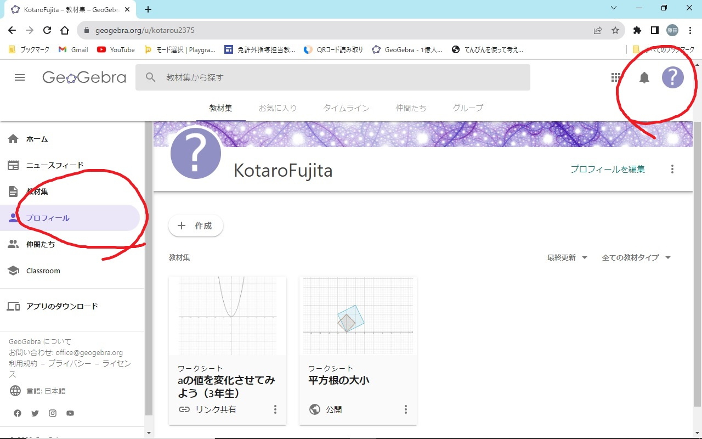
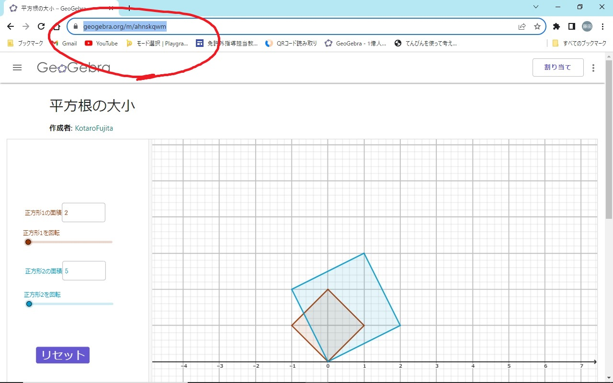
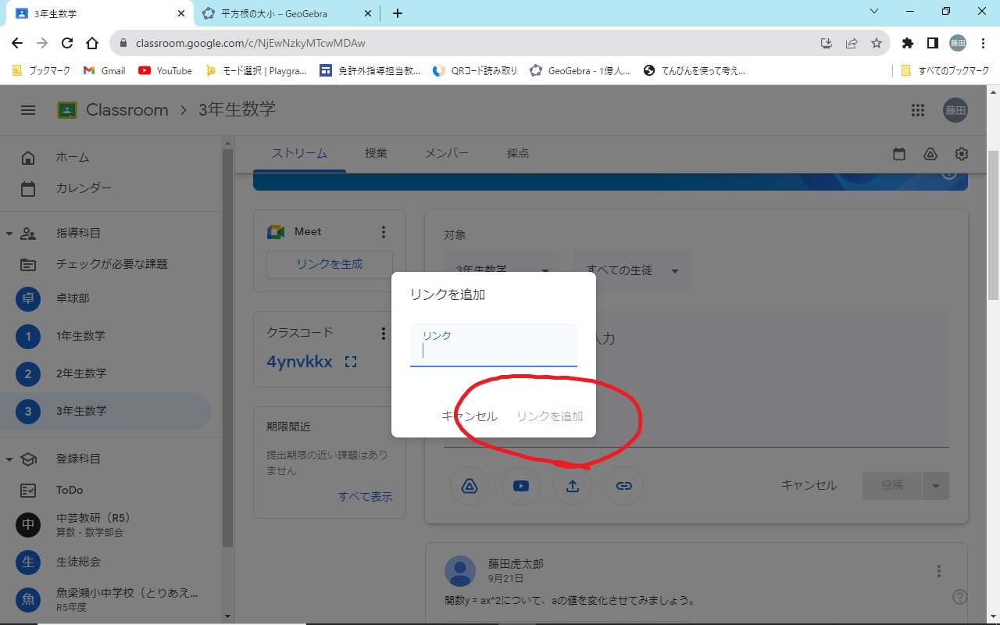
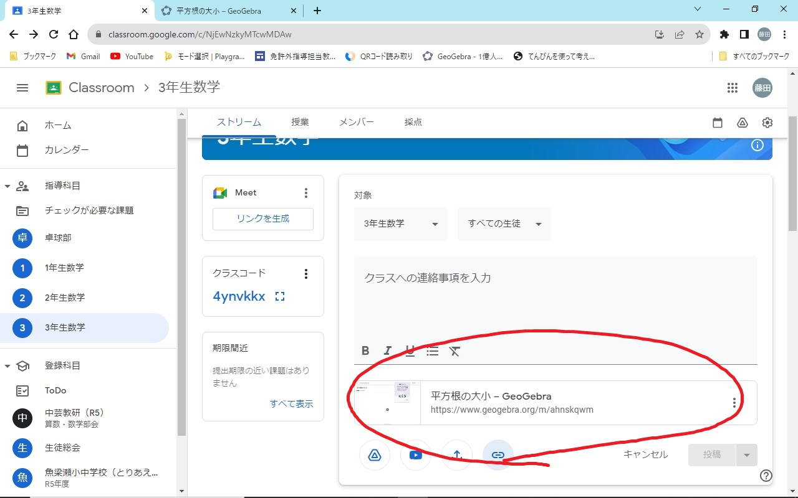

```{r global_option, include = FALSE}
knitr::opts_chunk$set(warning = FALSE, 
                      echo = FALSE, 
                      message = FALSE,
                      fig.width = 7,
                      fig.height = 5)
if (knitr::is_latex_output()) {
  knitr::opts_chunk$set(dev = "cairo_pdf")
}
```

\renewcommand{\thefootnote}{}
\newcounter{kaunta}
\renewcommand{\thekaunta}{\arabic{kaunta}}
\newcommand{\kaunta}{\refstepcounter{kaunta}%
\thekaunta}
\def\question{\noindent\fbox{\large\makebox[1em]{\text{\kaunta}}} \hspace{1pt}}
\newcounter{skaunta}
\renewcommand{\theskaunta}{\arabic{skaunta}}
\newcommand{\skaunta}{\refstepcounter{skaunta}%
\theskaunta}
\def\squestion{(\text{\skaunta})\hspace{2.5pt}}

# 全国学調自校採点結果を活用したPDCAサイクルの状況

## 特筆すべき問（大問1、3、8、9）とPDCA

### 大問1

大問1は自然数の定義に関する問であった。全員が不正解であり、自然数の定義を分かっていない実態が明らかとなった。解決法として、授業中に言葉を問う発問を多くしている。

* 自然数ってどういう意味でしたか。$\rightarrow$ みなさんの出席番号ですよ。
* 関数$y = ax + b$や$y = \dfrac{a}{x}$において、$a$ってなんでしたか。$\rightarrow$傾き$\rightarrow$他には？
* $2, 3, 5, 7, 11, \cdots$についてこういう数字はなんでしたか。$\rightarrow$素数$\rightarrow$素数の意味はなんでしたか。

### 大問3

大問3は平面の決定に関する問題である。3点で平面になるという知識は持っているということが分かった。ただし、なぜ3点で平面になるのかを理解していない可能性がある。

解決方法として、ICTを用いて、3次元の座標系に点をプロットさせ、平面を作る活動を取り入れることを考えている。3点で平面になることを発見させた後、発展的に「では空間3点をとればいつでも平面ができるのか。」という問を考えることも予定している。

### 大問8

大問8は連立方程式の利用である。本問を解答するためには方程式と関数の関係性についてしっかりとした理解が必要であり、読解力も必要となるため、難問である。

解決方法として、連立方程式とグラフの単元を丁寧に扱っている（別紙参照）。今後の計画として、連立方程式の利用の問題にさかのぼり、1次関数のグラフを使って問題解決をする取組を考えている。

### 大問9

大問9は本校の正答率は決して悪いものではなかった。しかし、証明に対して非常に本質的な問であると感じるため、特筆する。本問題を正解するためには平行線の性質に対する理解が必要である。また、仮定と結論の関係、すなわち、必要十分条件を理解している必要がある。

必要十分条件は中学数学では直接的に言葉として登場はしないものの、方程式領域における、解に対して、「これは問題に合っている。」など、概念的に登場するため重要である。授業において、「なぜ、この問題を解くのか。」、「問題を解くにはこの方法で良いのか。」という点を忘れさせないよう留意していきたい。図形領域における証明では、公理や定義から出発して、定理を証明していく過程を重視し、生徒がどういう歩みで今の問題を解いているのか定期的に振り返る時間を設定する。具体的には地図のようなものを作成する予定。

# 2学期の授業づくりの方向性

授業づくりの方向性は、指導要領に基づいて、馬路と連携しながら、最低限の内容を必ず行うことである。そのために、単元計画に基づいた授業を実施するためのタイムマネジメントを行うことと、授業づくり講座の学びを活かし、できるだけ教師が「話さない、教えない
授業」の2点を意識して授業づくりを行う。

2点同時達成のために、授業は問題解決や性質の発見に注力する。授業中には「なぜ？」という場面を多くとり、深い学びを目指す。ただし、問題解決に意識をおくと、問題演習をする時間が足りなくなってしまう。授業中に扱う問題を精選し、宿題の方に回す。

# 学力補完の取組等

学力補完の取組として、2学期から生徒の様子に合わせて過去の復習プリントを配布している。また、定期テスト前にはテスト対策のプリントを配布している。

特性のある生徒に対して、授業中の板書をとることが困難であるため、タブレットを用いて写真をとらせ、その上にペイント等で文字を書かせることで対応している。しかし、時間がかかることと、一度頭を通してほしいという個人的な願いから、数学に向いているテキストエディタがないか探している。

# その他

## geogebraのgoogle classroomへの共有方法

geogebraからクラスルームへの共有方法はgeogebraから割り当てを行うと失敗する。なので、最も古典的な手法を使用する。古典的な方法とは、作成したアプリケーションのURLをクラスルームの投稿にハイパーリンクとして貼り付ける方法である。この方法の説明を念の為、以下に示す。

まず、[geogebra](http://geogebra.org/)にアクセスする。



次に、左側にあるメニューバーからプロフィールを選択するか、右上のプロフィールアイコンを選択肢、プロフィールに移動する。



プロフィールに移動したら、共有したいアプリを左クリックし、移動する。今回は平方根の大小を共有する。



共有したいアプリに移動したら画面上部の検索バーにあるURLを選択し、コピーする。

次に、google classroomを開き、共有したいクラスに移動する。


あとは通常通りクラスルームの投稿を開く。


投稿をするところを開いたら下側のハイパーリンクボタンを左クリックする。



入力ボックスに先ほどコピーしたURLを貼り付け、***リンクを追加***を左クリックする。



投稿下側にgeogebraが表示されたら成功です。


