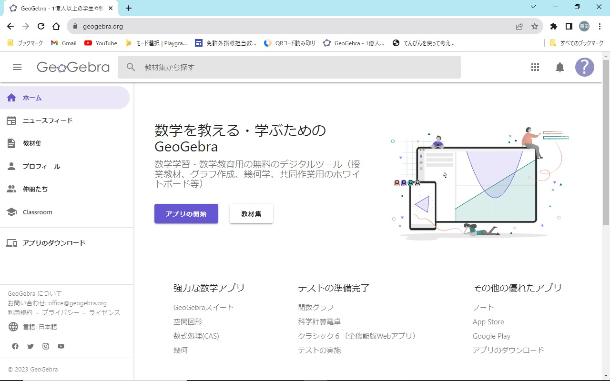

```{r global_option, include = FALSE}
knitr::opts_chunk$set(warning = FALSE, 
                      echo = FALSE, 
                      message = FALSE,
                      fig.width = 7,
                      fig.height = 5)
if (knitr::is_latex_output()) {
  knitr::opts_chunk$set(dev = "cairo_pdf")
}
```

\newcounter{kaunta}
\renewcommand{\thekaunta}{\arabic{kaunta}}
\newcommand{\kaunta}{\refstepcounter{kaunta}%
\thekaunta}
\def\question{\noindent\fbox{\large\makebox[1em]{\text{\kaunta}}} \hspace{1pt}}
\newcounter{skaunta}
\renewcommand{\theskaunta}{\arabic{skaunta}}
\newcommand{\skaunta}{\refstepcounter{skaunta}%
\theskaunta}
\def\squestion{(\text{\skaunta})\hspace{2.5pt}}

# geogebraで画面を二分割する方法

## 分割方法

まず、[geogebra](http://geogebra.org/)にアクセスする。



ここで、\color{red}青いアプリの開始ボタンを押すのではなく、\color{black}クラシック6（全機能番Webアプリ）をクリックする[^1]。

[^1]:全機能版であればよいので、geogebra classic5や6のダウンロード版でもできる。


起動すると次のような画面になる。


画面右上にある三本線をクリックし、メニューを出す。


表示をクリックする。


グラフィックス2にチェックを入れる。


するとグラフィックスビューの2つ目が出てくるはずです。

## オブジェクトの移動方法

2つ目のグラフィックスビューは最初からあるグラフィックスビューと同様の機能を持つ。そのため、通常の方法で点やグラフをプロットすることができる。しかし、授業用の教材で2画面にしたいのは、おそらくスクロールバーや入力ボックスを別画面に移動させてすっきりさせたいときだろう。

したがって、既に作成したオブジェクトを移動させる方法を主に説明する。今回は点を使うが、他のオブジェクトでも同様の方法で移動できる。（はずです...）

まず、点を右クリックし、設定を開く。


設定を開いたら、上側にある上級タブをクリックする。


上級タブの中にあるグラフィックス2にチェックを入れる。


これで点がグラフィックスビュー2にも現れる。グラフィックスビューのチェックを外すと最初から存在していたグラフィックスビューから消える。


